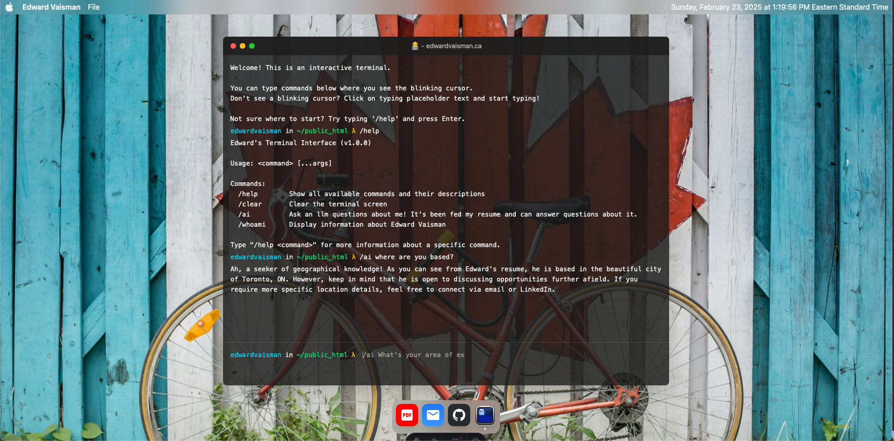
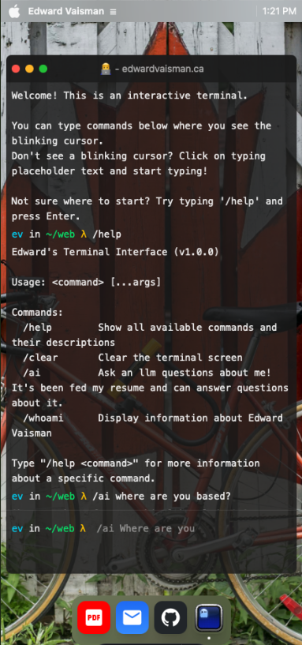

# Edward Vaisman's Website

Interactive personal website built with Astro and hosted on Cloudflare Workers. Features a macOS-inspired terminal interface with integrated LLM capabilities for resume queries and interaction. Looking for my resume? Head on over to [my resume repository](https://github.com/eddyv/awesome_cv/blob/main/cv.pdf)

## 🚀 Project Structure

```sh
/
├── public/                   # Static assets served as-is
│   └── favicon.svg          # Browser favicon
├── src/
│   ├── assets/              # Project assets (images, fonts, etc.)
│   │   └── wallpapers/      # Background wallpaper images
│   ├── components/          # Reusable UI components
│   ├── hooks/              # React custom hooks
│   ├── icons/              # Custom SVG icons
│   ├── layouts/            # Page layout templates
│   ├── middleware/         # Request middleware (rate limiting, CORS)
│   ├── pages/             # Route components and API endpoints
│   │   └── api/           # API route handlers
│   │       └── llm/       # Language model integration endpoints
│   ├── styles/            # Global styles and Tailwind config
│   └── utils/             # Shared utility functions
└── package.json
```

## 🧞 Commands

All commands are run from the root of the project:

| Command              | Action                                      |
| :------------------- | :------------------------------------------ |
| `bun install`        | Installs dependencies                       |
| `bun run dev`        | Starts local dev server at `localhost:4321` |
| `bun run build`      | Build your production site                  |
| `bun run preview`    | Preview your build locally with Wrangler (run `bun run build` first) |
| `bun run deploy`     | Build and deploy to Cloudflare Workers      |
| `bun run test`       | Run unit (Vitest) and e2e (Playwright) suites |
| `bun run fix`        | Format and auto-fix with Ultracite          |
| `bun run cf-typegen` | Generate Cloudflare types                   |

### Content management

Blog posts live in [EmDash CMS](https://docs.emdashcms.com) (Cloudflare
D1-backed, Portable Text). In local dev, miniflare simulates D1/R2 under
`.wrangler/state/`. Start the dev server and visit
`/_emdash/api/setup/dev-bypass?redirect=/_emdash/admin` once to seed the
content from `.emdash/seed.json` and open the admin panel. To reset the local
database: `rm -rf .wrangler/state`.

### Deploying

The site deploys as a Cloudflare Worker (`wrangler deploy` against the
build-generated `dist/server/wrangler.json`). One-time setup for a new
Worker environment:

```sh
bunx wrangler secret put GOOGLE_API_KEY   # required by /api/llm/gemini
bun run deploy
```

The `SESSION` KV namespace is auto-provisioned by the Cloudflare adapter on
first deploy. Custom-domain routing is managed in the Cloudflare dashboard.

## 🛠️ Technologies

- [Astro](https://astro.build)
- [React](https://react.dev)
- [Tailwind CSS](https://tailwindcss.com)
- [Cloudflare Workers](https://workers.cloudflare.com)
- [Google Gemini](https://ai.google.dev/gemini-api/docs#node.js)

## Demo

### Desktop Example



### Mobile Example


