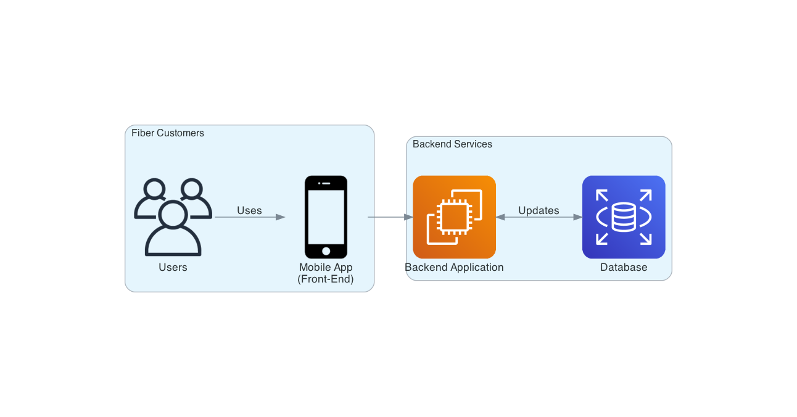
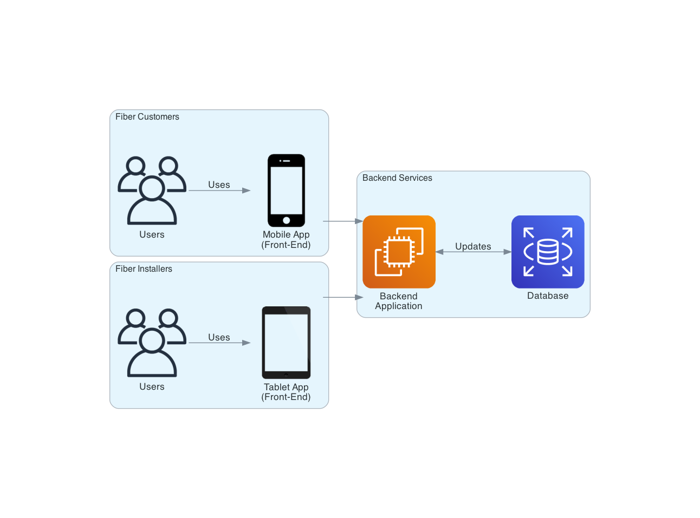
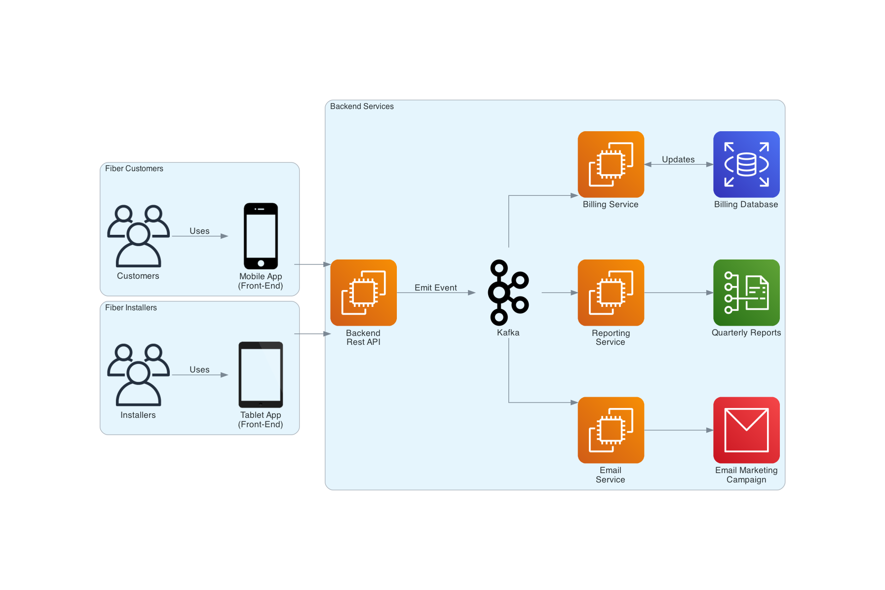

&nbsp;&nbsp;&nbsp;&nbsp;&nbsp;&nbsp;If you’ve never dealt with event-driven systems, then the decision to turn your organization's underlying architecture from a traditional model to an event-driven model is a difficult one. After all, our traditional model has provided us with so much success! It is the back-bone of our business, so why would we want to change it?

&nbsp;&nbsp;&nbsp;&nbsp;&nbsp;&nbsp;Inevitably, there comes a time when your organizations' growth reaches a breaking point. That breaking point only surfaces when you introduce enough ***actors*** to your domain. These actors all have their own wants and needs, but it’s not so easy keeping things cordial amongst actors. Sometimes the desires of one actor directly interferes with the desires of another. This creates a tension within the organization and makes decision-making that much harder, thus stunting your growth. How could we possibly keep all actors happy?

&nbsp;&nbsp;&nbsp;&nbsp;&nbsp;&nbsp;Consider the following simple application architecture, where we have fiber customers interacting with a mobile application to help manage their fiber accounts and services. When a customer performs an action in the app, it will communicate directly with our backend service, perform some super fun and complex business operations as well as propagate some changes to our database.

&nbsp;&nbsp;&nbsp;&nbsp;&nbsp;&nbsp;Nothing too crazy here, this is something we all may have experienced before in some capacity (professional or otherwise). The best thing about this architecture is, in a lot of cases it just works! Our customers are happy that the app is bringing them value via the ability to easily manage their account through the app instead of having to call in and speak with a representative. Additionally, our business is happy that our customer base is growing as a result of our easy-to-use application, giving us an edge on the competition. Thus, we’re all on cloud 9. Overall a great success. ***But what happens next after success?***

&nbsp;&nbsp;&nbsp;&nbsp;&nbsp;&nbsp;Where there is success, there is growth! Just because something is successful doesn’t mean it’s finished. ***Software is rarely considered finished.*** 

&nbsp;&nbsp;&nbsp;&nbsp;&nbsp;&nbsp;Consider the following: With the success of our application, our business now sees an opportunity to introduce another actor into the space (another revenue stream). This time, instead of only serving fiber customers, we will now introduce fiber installers to our workflow. Our fiber installers have their own front-end application (provided on a tablet) that have access to the same tools and services offered to our fiber customers, But with the added bonus that fiber installers are able to provide a discounted rate to our customers when onsite.

&nbsp;&nbsp;&nbsp;&nbsp;&nbsp;&nbsp;Here’s where conflict starts. It may not be so simple to just change the rate for our services depending on the actor. Installers need access to their own billing methods and options. These billing methods ***should not*** interfere with what is already pre-existing for fiber customers, or the business could potentially lose a fair chunk of change by charging incorrect amounts to our customers. Suddenly, to make this seemingly simple change requires an expensive and time-consuming regression test!

&nbsp;&nbsp;&nbsp;&nbsp;&nbsp;&nbsp;The end result? Changes are slower, more expensive, and become progressively more taxing on our common infrastructure. However, we do have a solution!

&nbsp;&nbsp;&nbsp;&nbsp;&nbsp;&nbsp;***In comes Kafka.*** With Kafka, we introduce an event-driven backbone for service based architecture. This backbone is the piece that finally allows us to decouple our actors from one-another. We do so by first modifying our original application architecture. The backend rest api that our actors used to communicate with no longer handles the complex business logic and operations it did in the past. Instead, that service will now ***emit events*** onto our backbone. These events provide a bunch of information, such as what action that was performed and by whom. Events emitted onto Kafka can then be listened on by many services, and those services can choose to perform actions on those events. By changing our architecture from a request-reply model to an event-driven model, ***our actors are now fully decoupled from one-another.***

&nbsp;&nbsp;&nbsp;&nbsp;&nbsp;&nbsp; For example, we now have the capability of separating our billing service for customers and installers. The billing service for customers will ignore any events that come from installers and vice versa. No regression tests are necessary as these ***services are no longer tightly-coupled*** to one another and, better yet, you ***leave your architecture open to extensibility***. Adding a new feature becomes a mere extension of the infrastructure we have in place. Want a separate email marketing campaign service targeting customers when they browse a new fiber plan? Go right ahead and add a listener to Kafka.

&nbsp;&nbsp;&nbsp;&nbsp;&nbsp;&nbsp; Now the question becomes, ***how do we offer Kafka at scale?***

-- EOF